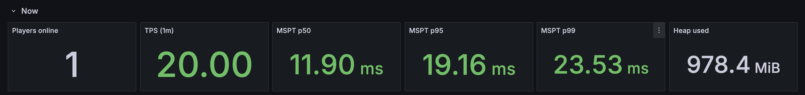

# TickScope — Minecraft monitoring for Prometheus and Grafana

[](https://github.com/gzimbric/TickScope/releases/latest)
[](https://github.com/gzimbric/TickScope/actions/workflows/build.yml)
[](LICENSE)
[](https://papermc.io)
[](https://papermc.io/software/folia)
[](https://adoptium.net)

TickScope is a lightweight Prometheus exporter for Minecraft Paper and Folia servers. The
dependency-free plugin exposes tick health, players, per-world counters, JVM and CPU statistics,
and player event counters for dashboards in Grafana.

```text
mc_tick_duration_seconds{statistic="p99"} 0.0216
mc_tps{window="1m"} 20.0
mc_players_online 4
mc_world_entities_by_type{world="world",type="chicken"} 35
```

## Highlights

- Exact p50, p95, and p99 tick times from Paper's raw tick-duration window
- Player-active regional TPS and average MSPT summaries where the Folia-compatible server API
  exposes them (including Canvas)
- Per-world entities, entity types, tile entities, chunks, and players
- JVM memory, threads, garbage collection, process CPU, and uptime
- No runtime dependencies, outbound telemetry, database, or embedded framework
- Main-thread-safe snapshots; HTTP scrapes never call Bukkit or block a tick
- Optional bearer authentication and failure-safe configuration reloads
- One jar for Paper and Purpur 1.18.2+, plus Folia and Canvas on supported modern releases

## Quick start

1. [Download the latest release](https://github.com/gzimbric/TickScope/releases/latest).
2. Put `TickScope-*.jar` in the server's `plugins/` directory and restart.
3. Scrape the default endpoint at `http://127.0.0.1:9101/metrics`.

```yaml
scrape_configs:
  - job_name: minecraft
    static_configs:
      - targets: ["127.0.0.1:9101"]
```

The default endpoint is open but bound to loopback. When Minecraft runs in Docker, follow the
[Docker installation notes](https://github.com/gzimbric/TickScope/wiki/Installation#running-in-docker)
before changing the bind address. Configure bearer authentication and TLS whenever metrics cross
a network you do not fully control.

## Grafana dashboard



[Download the dashboard JSON](assets/grafana/tickscope-dashboard.json), import it into Grafana,
and select the Prometheus data source that scrapes TickScope. A built-in server selector supports
one Paper server or a network of independently labeled backends.

## Documentation

The full manual lives in the [TickScope wiki](https://github.com/gzimbric/TickScope/wiki):

| Guide | Covers |
|---|---|
| [Installation](https://github.com/gzimbric/TickScope/wiki/Installation) | Requirements, upgrades, Prometheus, and Docker |
| [Configuration](https://github.com/gzimbric/TickScope/wiki/Configuration) | Every setting, bearer authentication, and commands |
| [Metrics reference](https://github.com/gzimbric/TickScope/wiki/Metrics) | Metric names, labels, semantics, and PromQL notes |
| [Grafana and Prometheus](https://github.com/gzimbric/TickScope/wiki/Grafana-and-Prometheus) | Scrape, remote-write, and dashboard examples |
| [Design and privacy](https://github.com/gzimbric/TickScope/wiki/Design-and-Privacy) | Architecture, collection cost, and security model |
| [Troubleshooting](https://github.com/gzimbric/TickScope/wiki/Troubleshooting) | Compatibility, missing series, and lag diagnosis |
| [Development and releases](https://github.com/gzimbric/TickScope/wiki/Development-and-Releases) | Building, testing, releases, and support |
| [Metric stability](https://github.com/gzimbric/TickScope/wiki/Metric-Stability) | Compatibility guarantees for names, labels, and semantics |

## Compatibility

Paper 1.18.2+, Paper-compatible Purpur servers, Folia, and Folia-compatible Canvas servers are
supported. Spigot, Bukkit, Velocity, and BungeeCord are not supported. Install TickScope on each
backend in a proxy network and assign each server a unique `server-id`.

Paper exposes a single server tick, so TickScope publishes exact `mc_tick_duration_seconds`,
`mc_tick_samples`, and `mc_tps` series there. Folia has no truthful server-wide equivalent. On Folia, those series are
intentionally absent and are replaced by `mc_folia_region_tps` summaries sampled at online player
locations. Servers exposing regional average tick times, including Canvas, also receive
`mc_folia_region_tick_duration_seconds`; this is average tick duration per player-active region
rather than a global percentile. Entity-by-type metrics are disabled on Folia because a world-wide entity walk would
cross region ownership boundaries. Other server, world, player, event, JVM, and process metrics
remain available.

## Download and support

- [Download on GitHub](https://github.com/gzimbric/TickScope/releases/latest)
- [Download on Modrinth](https://modrinth.com/plugin/tickscope)
- [Report a bug](https://github.com/gzimbric/TickScope/issues/new?template=bug_report.yml)
- [Request a feature](https://github.com/gzimbric/TickScope/issues/new?template=feature_request.yml)
- [Ask a question](https://github.com/gzimbric/TickScope/discussions)
- [Report a security issue privately](https://github.com/gzimbric/TickScope/security/advisories/new)

TickScope is maintained by [Gabe Zimbric](https://github.com/gzimbric) and licensed under
[GPL-3.0-or-later](LICENSE).
